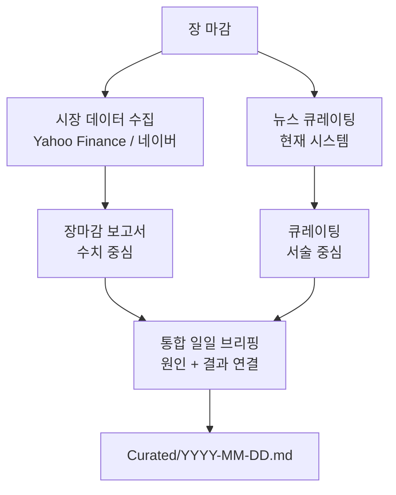

# 뉴스 큐레이션 vs 장마감 보고서

---

## 핵심 차이

| | 뉴스 큐레이션 | 장마감 보고서 |
|---|---|---|
| **질문** | "오늘 무슨 일이 있었나?" | "시장이 오늘 어떻게 반응했나?" |
| **데이터** | 뉴스 텍스트 | 주가·거래량·외인/기관 매매 |
| **시점** | 언제든 실행 가능 | 장 마감 후 고정 |
| **관점** | 내 투자 논리 기준 필터 | 시장 참여자 전체의 반응 |
| **출력** | 테마 + 투자 시사점 (서술) | 등락률·거래량·섹터 동향 (수치) |

> 큐레이션은 **맥락(why)**, 장마감 보고서는 **결과(what happened in price)**

---

## 현재 시스템의 맹점

큐레이션만으로는 뉴스의 시장 반영 여부를 알 수 없다.

> [!warning] 연결 고리 없음
> 삼성전자 파업 뉴스가 큐레이팅에서 "리스크"로 잡혔지만,
> 실제로 주가가 **5% 빠졌는지 0.3% 빠졌는지**는 알 수 없다.
> 뉴스의 중요성이 시장에서 실제로 확인됐는지 연결이 끊겨 있다.

---

## 이상적인 일일 브리핑 구조

두 개를 합치면 뉴스 원인과 시장 결과가 연결된다.

```
장마감 데이터 (주가·거래량)
        +
뉴스 큐레이팅 (원인·맥락)
        ↓
"오늘 삼성전자 -4.8%
 → 파업 우려가 주가에 반영됨
 → HBM 실적 기대로 반등 가능성 vs 생산 차질 장기화 리스크"
```

---

## 장마감 보고서 구성 요소

구현 시 포함할 데이터:

| 항목 | 내용 | 소스 |
|------|------|------|
| 주가 등락률 | 당일 종가 기준 % 변화 | Yahoo Finance |
| 거래량 | 평균 대비 거래량 배율 | Yahoo Finance |
| 외인/기관 순매수 | KRX 기업만 해당 | 네이버 금융 |
| 52주 위치 | 현재가 / 52주 고점 비율 | Yahoo Finance |
| 섹터 대비 | 같은 섹터 평균 대비 성과 | Yahoo Finance |

---

## 통합 보고서 흐름 (미래 설계)



---

## 관련 문서

- [[curation-design]] — 큐레이팅 현황 & 로드맵
- [[prompt-design]] — 프롬프트 설계
