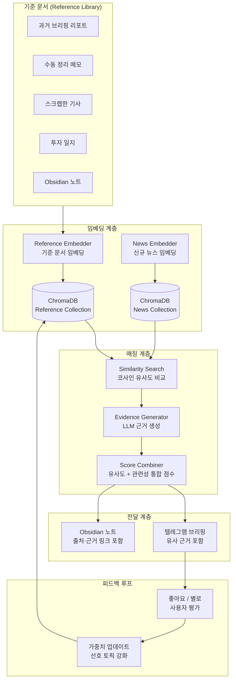

---
tags:
  - LangGraph
  - LLM
  - 프로젝트
  - 요건정의
  - RAG
  - 투자자동화
  - 유사검색
created: 2026-05-12
related:
  - "[[10-LLM-프로젝트/글로벌-뉴스리포트-수집요약-시스템-요건정의]]"
  - "[[10-LLM-프로젝트/\"미니 Bloomberg + AI Research Stack\"1]]"
  - "[[02-Agent-프레임워크/02-LangGraph/agent.md]]"
status: 요건정의
---

> [!abstract] 레퍼런스 기반 유사 뉴스 검색 시스템 설계
> 투자자가 과거에 작성한 리포트·메모·수동 정리 파일을 **기준 문서(Reference)**로 등록하면,
> 매 수집 회차마다 그 기준 문서와 **유사한 뉴스를 자동으로 찾아주고**,
> **왜 이 뉴스가 유사한지 근거(Evidence)를 함께 제시**하는 시스템.
> "내가 관심 있는 것과 비슷한 뉴스를 알아서 골라줘"를 구현한다.

---

## 1. 핵심 개념

### 1-1. 기존 방식 vs 레퍼런스 기반 방식

```
[기존 방식] 키워드 필터링
  뉴스 수집 → "반도체", "FOMC" 키워드 포함? → 포함하면 수집
  단점: 키워드에 없는 새로운 관점의 뉴스를 놓침
        투자자의 실제 관심사와 키워드가 불일치할 수 있음

[레퍼런스 기반] 유사도 매칭
  투자자의 과거 리포트·메모 → 임베딩 → "관심 프로파일" 생성
  뉴스 수집 → 임베딩 → 관심 프로파일과 유사도 비교
  → 유사도 높은 뉴스만 선별 + "왜 유사한지" 근거 제시
  장점: 키워드 없이도 투자자의 관심사를 학습
        시간이 갈수록 더 정확해짐 (피드백 루프)
```

### 1-2. 비유

```
키워드 필터 = 도서관에서 "반도체" 코너만 가는 것
레퍼런스 기반 = 사서에게 "이 논문과 비슷한 책 찾아주세요"라고 요청하는 것
                → 사서가 논문 내용을 이해하고 관련 책을 추천
                → "이 책은 3장에서 비슷한 주제를 다루고 있습니다" 근거 제시
```

---

## 2. 전체 아키텍처



---

## 3. 기준 문서(Reference) 관리

### 3-1. 기준 문서 유형

| 유형 | 예시 | 등록 방법 |
|------|------|----------|
| **과거 브리핑** | 시스템이 생성한 이전 세션 브리핑 | 자동 (매 회차 축적) |
| **수동 정리 메모** | 투자자가 직접 쓴 시황 메모·분석 노트 | 폴더 지정 (Obsidian 노트) |
| **스크랩 기사** | 투자자가 "이건 중요해"라고 저장한 기사 | 텔레그램 "저장" 명령 |
| **투자 일지** | 매매 근거·복기 노트 | 폴더 지정 |
| **외부 리포트** | 증권사 리포트 PDF 요약 | 자동 (리포트 수집 시) |

### 3-2. 기준 문서 폴더 구조

```
data/
├── references/
│   ├── auto/                    시스템 자동 축적
│   │   ├── briefs/              과거 브리핑 (세션별)
│   │   └── report_summaries/    리포트 요약
│   │
│   ├── manual/                  투자자가 직접 등록
│   │   ├── memos/               수동 정리 메모·분석 노트
│   │   ├── clippings/           스크랩 기사
│   │   └── journals/            투자 일지·매매 복기
│   │
│   └── registry.yaml            등록된 기준 문서 목록 + 메타데이터
```

### 3-3. 기준 문서 등록 방법

```python
# config/references.yaml — 기준 문서 소스 설정
reference_sources:
  # 1) Obsidian 노트 폴더 — 투자자의 수동 메모
  obsidian_folders:
    - path: "99-Misc/투자메모/"
      type: "manual_memo"
      scan_interval: "daily"       # 매일 새 파일 감지

    - path: "10-LLM-프로젝트/"
      type: "project_note"
      scan_interval: "weekly"

  # 2) 시스템 자동 축적
  auto_accumulate:
    - source: "session_briefs"     # 매 회차 브리핑
      keep_days: 90                # 최근 90일치 유지
      weight: 0.7                  # 기본 가중치

    - source: "report_summaries"   # 증권사 리포트 요약
      keep_days: 180
      weight: 0.8

  # 3) 텔레그램 스크랩 — 사용자가 "저장"한 뉴스
  telegram_scrap:
    enabled: true
    command: "/save"               # /save 명령으로 기준 문서에 추가
    weight: 1.0                    # 사용자 직접 선택 → 가중치 최고
```

---

## 4. 임베딩 및 유사도 검색

### 4-1. 임베딩 전략

```python
from chromadb.utils import embedding_functions

# 임베딩 모델 선택
# Option A: OpenAI (품질 최고, 비용 발생)
embed_fn = embedding_functions.OpenAIEmbeddingFunction(
    api_key="OPENAI_API_KEY",
    model_name="text-embedding-3-small"    # 1536차원, $0.02/1M토큰
)

# Option B: Gemini (구글 무료 임베딩)
embed_fn = embedding_functions.GoogleGenerativeAiEmbeddingFunction(
    api_key="GEMINI_API_KEY",
    model_name="models/text-embedding-004"
)

# ChromaDB 컬렉션 생성
import chromadb
client = chromadb.PersistentClient(path="data/chroma/")

# 기준 문서 컬렉션
ref_collection = client.get_or_create_collection(
    name="references",
    embedding_function=embed_fn,
    metadata={"hnsw:space": "cosine"}
)

# 뉴스 컬렉션
news_collection = client.get_or_create_collection(
    name="daily_news",
    embedding_function=embed_fn,
    metadata={"hnsw:space": "cosine"}
)
```

### 4-2. 기준 문서 임베딩 등록

```python
import hashlib
from pathlib import Path
from datetime import datetime

def register_reference(text: str, metadata: dict, ref_id: str = None):
    """
    기준 문서를 ChromaDB에 등록.
    이미 등록된 문서는 스킵 (중복 방지).
    """
    if ref_id is None:
        ref_id = hashlib.md5(text[:500].encode()).hexdigest()

    # 이미 등록 확인
    existing = ref_collection.get(ids=[ref_id])
    if existing["ids"]:
        return  # 이미 등록됨

    ref_collection.add(
        documents=[text],
        metadatas=[{
            "type": metadata.get("type", "unknown"),      # memo / brief / report
            "source_path": metadata.get("source_path", ""),
            "date": metadata.get("date", datetime.now().isoformat()),
            "weight": metadata.get("weight", 1.0),
            "user_rating": metadata.get("user_rating", 0), # 피드백 점수
        }],
        ids=[ref_id]
    )

def scan_and_register_obsidian_folder(folder_path: str, doc_type: str):
    """Obsidian 폴더를 스캔해서 새 노트를 기준 문서로 등록"""
    vault_root = Path("/Users/boon/Library/Mobile Documents/"
                       "iCloud~md~obsidian/Documents/obs_iterm")
    folder = vault_root / folder_path

    for md_file in folder.glob("*.md"):
        text = md_file.read_text(encoding="utf-8")
        # 프론트매터 제거
        if text.startswith("---"):
            end = text.find("---", 3)
            if end > 0:
                text = text[end+3:].strip()

        register_reference(
            text=text,
            metadata={
                "type": doc_type,
                "source_path": str(md_file.relative_to(vault_root)),
                "date": datetime.fromtimestamp(md_file.stat().st_mtime).isoformat(),
            }
        )
```

### 4-3. 유사 뉴스 검색 — 핵심 로직

```python
from typing import List, Dict

def find_similar_news(
    news_articles: List[dict],
    top_k: int = 15,
    similarity_threshold: float = 0.35,
) -> List[dict]:
    """
    수집된 뉴스를 기준 문서 컬렉션과 비교하여 유사한 뉴스를 선별.

    Parameters
    ----------
    news_articles : 이번 회차 수집된 뉴스 리스트
    top_k : 최종 선별할 뉴스 수
    similarity_threshold : 유사도 최소 임계치 (0.35 = 중간 관련성)

    Returns
    -------
    유사도 점수 + 매칭된 기준 문서 정보가 포함된 뉴스 리스트
    """
    results = []

    for article in news_articles:
        # 뉴스 텍스트로 기준 문서 컬렉션에서 유사 문서 검색
        query_text = f"{article['title']} {article.get('snippet', '')}"

        matches = ref_collection.query(
            query_texts=[query_text],
            n_results=3,                # 가장 유사한 기준 문서 3개
            include=["documents", "metadatas", "distances"]
        )

        if not matches["distances"][0]:
            continue

        # 코사인 거리 → 유사도 변환 (ChromaDB는 distance 반환)
        # cosine distance = 1 - cosine similarity
        best_similarity = 1 - matches["distances"][0][0]
        avg_similarity = sum(1 - d for d in matches["distances"][0]) / len(matches["distances"][0])

        if best_similarity < similarity_threshold:
            continue

        # 매칭 근거 정보 수집
        matched_refs = []
        for i, (doc, meta, dist) in enumerate(zip(
            matches["documents"][0],
            matches["metadatas"][0],
            matches["distances"][0]
        )):
            matched_refs.append({
                "rank": i + 1,
                "similarity": round(1 - dist, 4),
                "ref_type": meta["type"],
                "ref_source": meta.get("source_path", ""),
                "ref_date": meta.get("date", ""),
                "ref_snippet": doc[:200] + "..." if len(doc) > 200 else doc,
                "weight": meta.get("weight", 1.0),
            })

        # 가중 평균 유사도 (사용자 직접 저장한 문서에 더 높은 가중치)
        weighted_score = sum(
            r["similarity"] * r["weight"] for r in matched_refs
        ) / sum(r["weight"] for r in matched_refs)

        article["ref_similarity"] = round(best_similarity, 4)
        article["ref_weighted_score"] = round(weighted_score, 4)
        article["matched_references"] = matched_refs
        results.append(article)

    # 유사도 내림차순 정렬 → 상위 top_k개 선별
    results.sort(key=lambda x: x["ref_weighted_score"], reverse=True)
    return results[:top_k]
```

---

## 5. 근거(Evidence) 생성 — LLM 기반

### 5-1. 유사 이유를 자연어로 설명

```python
PROMPT_EVIDENCE = """
아래 [뉴스]가 [기준 문서]와 유사하다고 판단되었다.
왜 유사한지, 한국 투자자 관점에서 어떤 연결점이 있는지 2~3줄로 설명하라.

[뉴스 제목]: {news_title}
[뉴스 요약]: {news_summary}

[기준 문서 출처]: {ref_source}
[기준 문서 내용 일부]: {ref_snippet}

[유사도 점수]: {similarity_score}

[출력 형식]:
**매칭 근거**: [왜 이 뉴스가 기준 문서와 관련 있는지 설명]
**투자 연결점**: [이전 분석과 이번 뉴스를 연결한 투자 시사점]
"""

async def generate_evidence(
    article: dict,
    llm  # Gemini Flash
) -> str:
    """유사 뉴스에 대해 LLM이 매칭 근거를 자연어로 생성"""
    best_ref = article["matched_references"][0]

    prompt = PROMPT_EVIDENCE.format(
        news_title=article["title"],
        news_summary=article.get("summary_kr", article.get("snippet", "")),
        ref_source=best_ref["ref_source"],
        ref_snippet=best_ref["ref_snippet"],
        similarity_score=f"{best_ref['similarity']:.1%}"
    )

    response = await llm.ainvoke(prompt)
    return response.content
```

### 5-2. 배치 근거 생성 (비용 최적화)

```python
PROMPT_BATCH_EVIDENCE = """
아래 뉴스 목록에 대해 각각 기준 문서와의 매칭 근거를 작성하라.
JSON 배열로 응답하라.

[뉴스-기준문서 쌍 목록]:
{pairs_json}

[출력 형식]:
[
  {{
    "news_id": "001",
    "evidence": "기준 문서에서 반도체 HBM 수주 확대를 분석했는데, 이번 뉴스도 동일한 HBM 수주 계약 관련 내용",
    "investment_link": "이전 분석에서 SK하이닉스 목표가 상향 근거로 HBM을 언급. 이번 뉴스가 추가 확인"
  }},
  ...
]
"""
```

---

## 6. 최종 출력 — 근거 포함 브리핑

### 6-1. 텔레그램 출력 예시

```
📊 오전 브리핑 (2026-05-12) | 06:30 KST
━━━━━━━━━━━━━━━━━━━━━━━━━━━

🎯 내 관심사 기반 맞춤 뉴스 TOP 5

1️⃣ [엔비디아 HBM3E 추가 수주 계약 체결]
   유사도: 92% | 근거: 5/8 투자메모
   📎 매칭 근거: 5/8 메모에서 "HBM3E 양산 본격화 시
   SK하이닉스 수혜 예상"이라고 분석. 이번 뉴스는 그
   양산 수주가 실제로 확대되고 있음을 확인.
   💡 투자 연결: SK하이닉스 목표가 상향 근거 강화.

2️⃣ [Fed 파월 "데이터 의존 접근 유지" 재확인]
   유사도: 87% | 근거: 5/5 FOMC 분석 리포트
   📎 매칭 근거: 5/5 분석에서 "6월 FOMC까지 금리
   동결 예상, PCE 지표가 핵심 변수"라고 정리.
   이번 연설도 동일한 기조 유지.
   💡 투자 연결: 금리 동결 시나리오 유지. 리츠·배당주 유효.

3️⃣ [중국 5월 수출 예상 상회 +8.2% YoY]
   유사도: 78% | 근거: 4/30 중국경기 분석노트
   📎 매칭 근거: 4/30 노트에서 "중국 PMI 반등이
   수출 회복으로 이어지는지가 관건"이라고 작성.
   이번 수출 지표가 실제 회복세를 확인.
   💡 투자 연결: 포스코·LG화학 등 중국 관련주 재점검.

4️⃣ [BOJ 우에다 총재 "엔화 약세 경계" 발언]
   유사도: 71% | 근거: 5/1 환율분석 메모
   📎 매칭 근거: 5/1 메모에서 "BOJ 정책 변화 시
   엔/원 환율 영향으로 수출주 변동성 확대 예상".
   💡 투자 연결: 엔화 강세 전환 시 한국 수출주 영향 주시.

5️⃣ [TSMC 일본 2공장 가동 시점 앞당김]
   유사도: 65% | 근거: 반도체 투자일지 시리즈
   📎 매칭 근거: 투자일지에서 "파운드리 공급 확대가
   NAND/DRAM 가격에 미치는 영향" 분석.
   💡 투자 연결: 반도체 장비주(한미반도체) 수혜 가능.

━━━━━━━━━━━━━━━━━━━━━━━━━━━
📋 기타 주요 뉴스 (키워드 기반)
  ... (기존 키워드 필터 결과)
```

### 6-2. Obsidian 노트 출력

```markdown
---
tags: [일간리포트, 레퍼런스매칭]
created: 2026-05-12
---

# 맞춤 뉴스 리포트 — 2026-05-12 오전

## 레퍼런스 매칭 뉴스 TOP 5

### 1. 엔비디아 HBM3E 추가 수주 계약 체결
- **유사도**: 92%
- **매칭 기준 문서**: [[99-Misc/투자메모/2026-05-08-반도체분석.md]]
- **매칭 근거**: 5/8 메모의 "HBM3E 양산 → SK하이닉스 수혜" 분석과
  이번 뉴스의 수주 확대가 직접 연결됨.
- **투자 연결점**: SK하이닉스 목표가 상향 근거 추가 확인.
- **원문 링크**: [Reuters](https://...)
```

---

## 7. 통합 점수 설계 — 유사도 + 관련성 결합

### 7-1. 두 가지 점수 체계

```
[점수 1] 관련성 점수 (Relevance Score) — 기존
  → LLM이 "이 뉴스가 투자자에게 얼마나 중요한가" 0~100점 평가
  → 범용적 투자 관련성

[점수 2] 유사도 점수 (Reference Similarity) — 신규
  → 기준 문서와의 코사인 유사도 0~100%
  → 개인화된 관심도

[통합 점수] = α × 관련성 + β × 유사도

기본값: α=0.4, β=0.6 (개인 관심사 우선)
설정으로 조절 가능 (키워드 중심이면 α > β)
```

### 7-2. 점수 결합 코드

```python
def compute_combined_score(
    relevance_score: float,        # 0~100 (LLM 평가)
    ref_similarity: float,         # 0~1.0 (코사인 유사도)
    user_rating_boost: float = 0,  # 피드백에 의한 보정
    alpha: float = 0.4,
    beta: float = 0.6,
) -> float:
    """
    통합 점수 계산.

    투자자가 직접 저장(/save)한 문서와 유사하면 추가 보너스.
    과거에 "좋아요"를 받은 매칭 패턴이면 추가 보너스.
    """
    # 0~100 스케일로 통일
    similarity_100 = ref_similarity * 100

    base_score = alpha * relevance_score + beta * similarity_100

    # 피드백 보정 (좋아요=+5, 별로=-5, 누적)
    adjusted_score = base_score + user_rating_boost

    return max(0, min(100, adjusted_score))
```

---

## 8. 피드백 루프 — 시간이 갈수록 정확해지는 시스템

### 8-1. 사용자 피드백 수집

```python
# 텔레그램에서 피드백 버튼
# 매칭 뉴스마다 [👍 좋은 매칭] [👎 관련 없음] 버튼 제공

async def handle_feedback(update, context):
    """텔레그램 콜백: 사용자가 매칭 품질 평가"""
    data = update.callback_query.data
    # data = "feedback:article_id:good" or "feedback:article_id:bad"

    _, article_id, rating = data.split(":")

    if rating == "good":
        # 1) 이 뉴스를 기준 문서에 추가 (좋은 매칭 → 관심사 확장)
        article = load_article(article_id)
        register_reference(
            text=article["summary_kr"],
            metadata={"type": "user_approved", "weight": 1.2}
        )
        # 2) 매칭된 기준 문서의 가중치 상향
        boost_reference_weight(article["matched_references"][0]["ref_id"], +0.1)

    elif rating == "bad":
        # 매칭된 기준 문서의 가중치 하향
        reduce_reference_weight(article["matched_references"][0]["ref_id"], -0.05)
        # 이 뉴스를 네거티브 샘플로 기록 (향후 유사 패턴 회피)
        add_negative_sample(article_id)

def boost_reference_weight(ref_id: str, delta: float):
    """기준 문서의 가중치를 조정"""
    meta = ref_collection.get(ids=[ref_id], include=["metadatas"])
    current_weight = meta["metadatas"][0].get("weight", 1.0)
    new_weight = max(0.1, min(2.0, current_weight + delta))
    ref_collection.update(
        ids=[ref_id],
        metadatas=[{**meta["metadatas"][0], "weight": new_weight}]
    )
```

### 8-2. 피드백 효과 흐름

```
Day 1: 기준 문서 10개로 시작 (수동 메모 + 과거 브리핑)
  → 유사도 매칭 정확도 ~60%

Day 7: 사용자가 "좋은 매칭" 20건, "관련없음" 8건 피드백
  → 좋은 매칭 뉴스가 기준 문서에 추가 → 관심 프로파일 확장
  → 관련없음 패턴 학습 → 유사하지만 관련없는 뉴스 필터링
  → 정확도 ~72%

Day 30: 기준 문서 50개+ (자동 축적 + 피드백)
  → 투자자의 관심사가 정밀하게 반영됨
  → 정확도 ~85%

Day 90: 기준 문서 100개+
  → 새로운 테마가 등장해도 관련 뉴스 즉시 탐지
  → "투자자 전용 뉴스 큐레이터" 수준
```

---

## 9. 회차별 처리 흐름

```
회차 시작 (06:30 KST 예시)
│
├─ Step 1. 뉴스 수집 (RSS + GDELT + 네이버)
│   → ~300건 원본 수집
│
├─ Step 2. 중복 제거
│   → ~200건
│
├─ Step 3. [기존] 키워드 관련성 점수 (LLM)
│   → 투자 관련 50~80건 필터
│
├─ Step 4. [신규] 레퍼런스 유사도 검색 ★
│   → 기준 문서 컬렉션과 코사인 유사도 비교
│   → 유사도 35% 이상인 뉴스 선별 (~30건)
│
├─ Step 5. [신규] 통합 점수 계산 ★
│   → 관련성 × 0.4 + 유사도 × 0.6 = 통합 점수
│   → 상위 15건 선별
│
├─ Step 6. [신규] 근거 생성 (LLM) ★
│   → 선별된 15건에 대해 "왜 유사한지" 2~3줄 설명
│   → 어느 기준 문서와 매칭되었는지 출처 명시
│
├─ Step 7. 번역 + 계층적 요약
│   → Level 1~3 요약 (기존 로직)
│
├─ Step 8. 전달
│   → 텔레그램: 맞춤 뉴스 TOP 5 (근거 포함) + 기타 뉴스
│   → Obsidian: 일간 노트 (기준 문서 링크 포함)
│
└─ Step 9. 축적
    → 이번 브리핑을 기준 문서에 자동 추가
    → 사용자 피드백 대기
```

---

## 10. 추가 비용 분석

| 항목 | 추가량 | 추가 비용 |
|------|--------|----------|
| 임베딩 (기준 문서 등록) | 초기 50건 + 일 5건 | ~$0.001/일 |
| 임베딩 (뉴스 검색 쿼리) | 일 200건 | ~$0.004/일 |
| LLM 근거 생성 | 일 15건 × 5회 = 75건 | ~$0.08/일 |
| ChromaDB 저장 | 일 200건 증가 | $0 (로컬) |
| **일 추가 비용** | | **~$0.09/일** |
| **월 추가 비용** | | **~$2.7/월** |
| **기존 + 추가 합계** | | **~$10.7/월** |

---

## 11. 구현 우선순위

```
Week 1 — 기준 문서 임베딩 인프라
  ├─ ChromaDB reference 컬렉션 생성
  ├─ Obsidian 폴더 스캔 → 자동 임베딩 등록
  └─ 수동 등록 CLI 도구

Week 2 — 유사도 검색 통합
  ├─ 기존 뉴스 파이프라인에 유사도 검색 노드 추가
  ├─ 통합 점수 계산 로직
  └─ 유사도 기반 필터링

Week 3 — 근거 생성 + 출력
  ├─ LLM 근거 생성 프롬프트
  ├─ 텔레그램 출력 포맷 (근거 포함)
  ├─ Obsidian 노트 출력 (위키링크 포함)
  └─ 피드백 버튼 (텔레그램)

Week 4 — 피드백 루프 + 안정화
  ├─ 좋아요/별로 피드백 처리
  ├─ 기준 문서 가중치 자동 조정
  ├─ 브리핑 자동 축적
  └─ 성능 튜닝 (임계치 조정)
```

---

> [!tip] 핵심 가치
> 기존 키워드 필터 = "내가 아는 것만 찾는다"
> 레퍼런스 기반 = **"내가 관심 있던 것과 비슷한 것을 시스템이 찾아준다"**
> → 투자자가 놓칠 수 있는 연관 뉴스를 자동으로 발굴하고,
> → 왜 중요한지 과거 분석과 연결해서 설명해준다.

> [!summary] 한 줄 요약
> 과거 리포트·메모를 ChromaDB에 임베딩 → 매 수집 회차마다 코사인 유사도로 맞춤 뉴스 발굴
> → LLM이 "왜 유사한지" 근거 생성 → 피드백 루프로 시간이 갈수록 정확도 향상.
