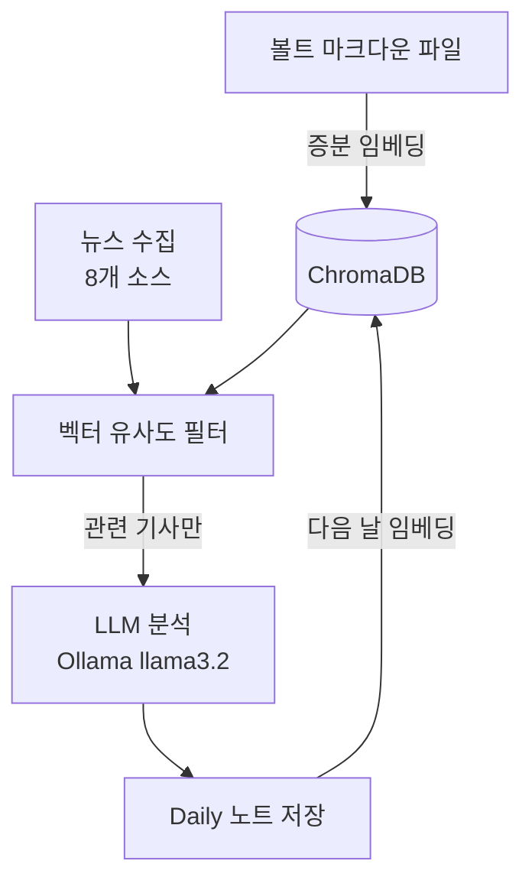

# VaultPulse

> "내가 쌓은 투자 리서치를 필터로 삼아, 매일 관련 뉴스를 자동으로 골라 Obsidian에 정리하는 개인 인텔리전스 파이프라인"

## 핵심 개념

단순 키워드 알림이나 뉴스 피드와의 차이는 **필터 기준**이다.

일반 뉴스 알림 → 키워드(삼성전자, NVDA)가 기준  
VaultPulse → **볼트에 내가 쓴 글**이 기준

볼트에 HBM 경쟁력 분석을 써둔 사람은 HBM 관련 뉴스가 높은 유사도로 선별된다. 같은 "삼성전자" 기사라도 노사 갈등 기사는 낮게, 메모리 공정 기사는 높게 잡힌다. **내가 무엇에 관심 있는지**가 필터를 만든다.

> [!info] RAG 역방향 응용
> 일반 RAG: 질문 → 문서 검색 → 답변 생성
> VaultPulse: **문서(볼트) → 뉴스 필터링** → 인사이트 생성
> 구조가 반대다. 질문 대신 축적된 지식이 레이더 주파수가 된다.

---

## 파이프라인



**피드백 루프**: 볼트가 커질수록 필터가 정교해진다. 오늘의 뉴스 노트가 내일의 필터 재료가 된다.

---

## 아키텍처

### Phase A — 볼트 인덱싱 (변경 파일만)
볼트 전체를 스캔하되 `mtime + MD5`로 변경된 파일만 재임베딩. 볼트가 수백 개 파일로 커져도 일일 실행 시간이 일정하다.

### Phase B — 뉴스 수집
| 거래소 | 소스 |
|--------|------|
| KRX | Naver 뉴스 API, DuckDuckGo, Google News RSS |
| NASDAQ/NYSE | Yahoo Finance RSS (24h 캐시), DuckDuckGo, Google News RSS |
| HKEX/SZSE | Yahoo Finance, HKEX 공시, Google News (zh) |
| TWSE | Yahoo Finance, MOPS 공시, Google News (zh-TW) |
| TSE | Yahoo Finance, TDnet 공시, Google News (ja) |

### Phase C — 관련성 분석
1. 코사인 유사도로 상위 K개 청크 선별 (KRX 임계값 0.75, 해외 0.95)
2. 통과한 기사만 LLM이 "왜 관련 있는가" 근거 생성
3. 전체 뉴스를 종합한 테마별 큐레이션 작성

---

## 기술 스택

| 영역 | 선택 | 이유 |
|------|------|------|
| 임베딩 | nomic-embed-text (Ollama) | 로컬 무료, 한/영 모두 양호 |
| 벡터 DB | ChromaDB | 경량, 파일 기반 영구 저장 |
| LLM | llama3.2 (Ollama) | 로컬 실행, API 비용 없음 |
| 뉴스 소스 | Naver API, DDG, Yahoo, Google News RSS 등 | 무료 공개 소스 조합 |
| 스케줄러 | macOS LaunchAgent | 오전 7시(a), 오후 6시(b) 2회 실행 |
| 볼트 | Obsidian | 마크다운 기반, 로컬 저장 |

---

## 볼트 구조

```
sample_vault/
├── Companies/
│   ├── KR/        삼성전자 · SK하이닉스 · 현대차 · LG에너지솔루션 · 포스코홀딩스
│   ├── US/        Apple · NVIDIA · Microsoft · Alphabet · Amazon · Meta · Tesla 외
│   ├── CN/        Tencent · Alibaba · CATL · BYD · Xiaomi
│   ├── TW/        TSMC · MediaTek · Delta Electronics · Nanya
│   ├── JP/        SoftBank · Kioxia · Tokyo Electron
│   └── Private/   OpenAI · Anthropic · SpaceX
│
│   각 기업 폴더:
│   ├── {기업명}.md    프로필 (배치 자동 생성, 덮어쓰지 않음)
│   ├── Daily/         일일 뉴스 + 큐레이션 (배치 전용)
│   ├── Research/      리서치 PDF 요약 (배치 전용)
│   └── Memos/         투자 메모 (사용자 전용, 시스템 수정 불가)
│
└── Digest/            전사 일일 요약
```

> [!warning] 영역 구분
> `Memos/` 폴더는 사용자가 직접 쓰는 유일한 영역이다. 배치는 절대 수정하지 않는다.
> `Daily/`, `Research/`는 배치 전용이다. 수동으로 편집하면 다음 실행에 덮어써진다.

---

## 설계 원칙

- **비파괴 동기화**: 이미 존재하는 프로필 파일은 덮어쓰지 않는다
- **부분 실패 허용**: 뉴스 소스 하나가 실패해도 파이프라인이 중단되지 않는다
- **2단계 필터**: 벡터 유사도로 사전 필터 → 통과한 기사만 LLM 처리 (비용/속도 절감)
- **증분 인덱싱**: 변경된 볼트 파일만 재임베딩

---

## 현재 한계

- **Yahoo Finance 429**: 당일 첫 fetch 실패 시 캐시가 없어 해당 종목 뉴스 누락. 다음날 자동 복구.
- **DuckDuckGo 불안정**: 검색 결과가 없거나 타임아웃(20s) 발생 시 조용히 건너뜀
- **LLM 품질**: llama3.2는 한국어 추론 품질이 영어 대비 낮다. Claude API로 교체하면 개선 가능.
- **단일 머신 의존**: macOS LaunchAgent 기반이므로 Mac이 꺼져 있으면 수집 누락
- **ChromaDB 동시 실행**: 두 프로세스가 같은 DB를 쓰면 충돌 가능. 현재 graceful fallback 처리됨.

---

## 확장 가능성

- **포트폴리오 연동**: 보유 종목 비중에 따라 뉴스 우선순위 가중치 조정
- **가격 이벤트 트리거**: 당일 ±5% 이상 주가 변동 시 즉시 뉴스 수집 실행
- **섹터 크로스 분석**: 개별 기업이 아닌 섹터(반도체, 전기차) 단위 큐레이션
- **Telegram 알림**: 중요도 높은 뉴스(★★★★★) 즉시 푸시
- **LLM 업그레이드**: Claude API 또는 GPT-4o로 교체 → 한국어 분석 품질 향상
- **영구 메모리**: 기업별 과거 큐레이션 요약을 볼트에 누적 → 장기 트렌드 추적


-- 위 소스들을 가지고 블로그나 유투브를 생성할 수 있을까.. 
